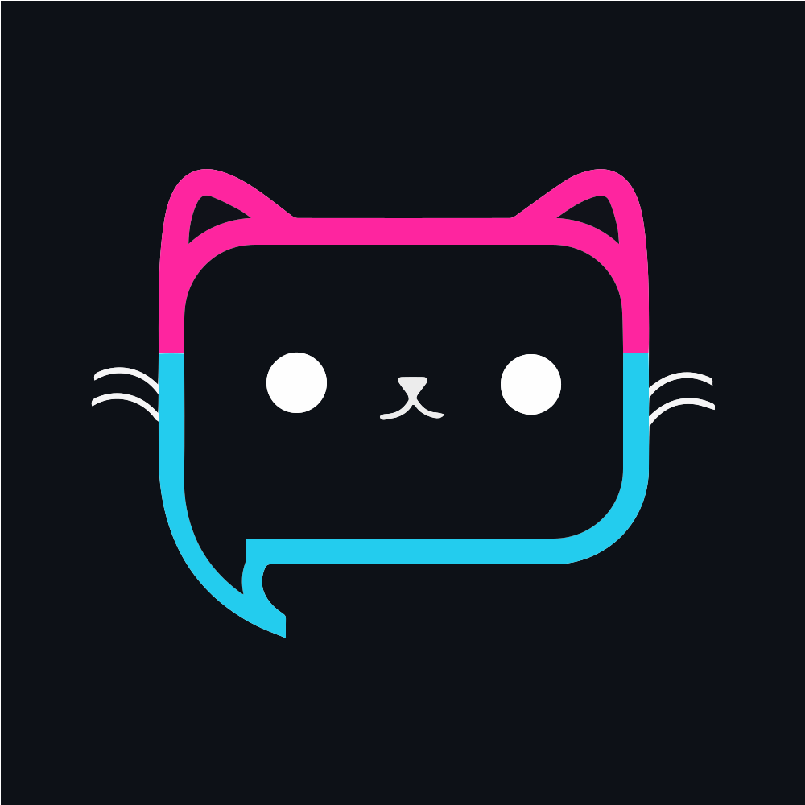

<!-- PROJECT LOGO -->
<br />
<p align="center">
  <span style="font-family:Papyrus; font-size:50px;"></span>
  <h3 align="center">Edu Mingle</h3>


# Chat Application 

A simple chat application that covers Django authorization, web sockets and authentication.

### Features ⭐

1. CRUD users
2. Create Users, rooms and chat in groups!
3. Good looking UI
4. Authenticated WebSockets to prevent unauthorized access

## Setup 🛠
1. Clone or download the repository  
```bash
git clone https://github.com/AkshayaTonde/EduMingle_app.git
```
2. Create and activate virtual environment
```bash
python -m venv venv
```
Windows: `venv\Scripts\activate.bat`  
Linux: `source venv/bin/activate`

3. Install required packages
```bash
python -m pip install -r requirements.txt
```

4. Navigate to chat-app-django and run the server
```bash
python manage.py runserver
```
*Note: make migrations if any error occurs*
```bash
python manage.py makemigrations
python manage.py migrate
```

5. Navigate to http://127.0.0.1:8000 on a browser of your choice.

Here’s an example **procedure** section for your application based on the provided example structure:

---

## Procedure

### Part 1 - User Management (Login, Signup, Profile Management)
1. **Users Model**:
   - Utilized the `Profile` model to extend user information (e.g., profile picture, bio, study preferences).
   - One-to-one relationship with Django’s built-in `User` model.

2. **Pages**:
   - **Login**: Allows existing users to log in.
   - **Signup**: New users can register with necessary details.
   - **Home**: Dashboard showing user-specific details or global updates.
   - **Profile**: Enables users to view and edit their profiles.

3. **CRUD Operations**:
   - Users can update their profile information, including username, profile picture, and bio.
   - Admin functionality for managing user accounts.

---

### Part 2 - Study Partner Matching
1. **Study Partners Functionality**:
   - Matches users based on quiz responses using the K-Nearest Neighbors (KNN) algorithm.
   - Displays matched profiles with their compatibility scores.

2. **Pages**:
   - **Quiz**: Users complete a quiz to provide inputs for matching.
   - **Study Partners**: Lists matched users with options to view profiles or send connection requests.

3. **Connection Requests**:
   - Users can send, accept, or reject connection requests.
   - Only approved connections appear in the "My Connections" page.

---

### Part 3 - Chat Application (For Connected Users)
1. **Channels Library**:
   - Integrated Django Channels to enable real-time messaging between connected users.

2. **Async Implementation**:
   - Implemented basic chat functionality and transitioned to an asynchronous model for better scalability.
   - Utilized `InMemoryChannelLayer` during development for testing real-time communication.

3. **Production-Ready Enhancements**:
   - Plan to integrate **Redis** as the channel layer during production for better performance and scalability.
   - Added functionality to create and join chat rooms dynamically.

---

### Part 4 - Deployment
1. **Free Hosting**:
   - Plan to deploy on **Render** or **PythonAnywhere** for free hosting.
   - Configured PostgreSQL as the database for production deployment.

2. **Next Steps**:
   - Add HTTPS support for security.
   - Monitor and test the app for scalability and performance issues.

---

Let me know if you’d like to refine or expand any part of this!

```py
user = self.scope['user']
if user.is_authenticated:
    // authenticated user connection 
else:
    // unauthenticated acces - disconnect/close
```

### Resources
1. [Django Tutorial - Corey Schafer](https://www.youtube.com/watch?v=UmljXZIypDc&list=PL-osiE80TeTtoQCKZ03TU5fNfx2UY6U4p) 
2. [Django Channels - RealPython](https://realpython.com/getting-started-with-django-channels/)
3. [Django Channels](https://channels.readthedocs.io/)
4. [Django Channels and WebSockets oversimplified - Dennis Ivy](https://www.youtube.com/watch?v=cw8-KFVXpTE)
5. [Token Auth middleware ideas](https://gist.github.com/rluts/22e05ed8f53f97bdd02eafdf38f3d60a)


